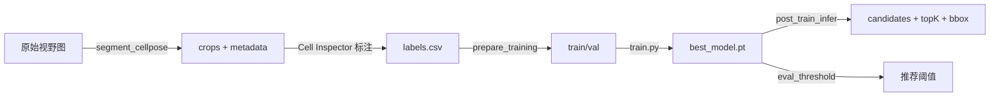

# method_2 — 目标细胞检测流水线

基于 Cellpose 分割 + ResNet18 二分类的目标细胞检测系统，配套 Streamlit 标注工具 Cell Inspector。

## 项目结构

```
method_2/
├── baseline_v0/              # ML 流水线
│   ├── config.yaml           # 统一配置（训练 / 推理 / 分割）
│   ├── datasets/             # PyTorch Dataset
│   ├── models/               # ResNet18 分类器
│   ├── utils/                # 共享工具（config、模型加载、划分逻辑等）
│   ├── preprocess/           # Cellpose 分割
│   ├── train/                # 模型训练
│   ├── inference/            # 候选检测与可视化
│   ├── scripts/              # 数据准备、阈值评估等脚本
│   ├── data/                 # 数据目录（gitignore，需自行准备）
│   └── outputs/              # 运行输出（gitignore）
├── cell_inspector/           # Streamlit 单细胞标注工作站
│   ├── app.py
│   ├── core/                 # metadata、标注逻辑
│   ├── ui/                   # 界面组件
│   └── scripts/              # 导出、metadata 生成
├── requirements.txt
└── environment.yml
```

## 环境安装

```bash
conda activate base          # 或自建 conda 环境
pip install -r requirements.txt
```

Windows 终端 UTF-8（可选）：

```bash
activate_env.bat
```

## 完整流水线



### 1. 分割

```bash
cd baseline_v0
python preprocess/segment_cellpose.py --batch fetal_culture --clean
python preprocess/segment_cellpose.py --batch blood_cell --clean
```

### 2. 标注

```bash
streamlit run cell_inspector/app.py
# metadata 路径填: baseline_v0/data/crops/fetal_culture/metadata.csv
```

### 3. 准备训练数据

```bash
cd baseline_v0
python scripts/prepare_training.py
```

按 `image_id` 划分 train/val，并自动导入 hard negatives（混合血样）。

### 4. 训练

```bash
python train/train.py
```

训练结束后自动运行阈值评估与验证集预测导出。

### 5. 推理

```bash
python scripts/post_train_infer.py
```

或分步执行：

```bash
python inference/detect_candidates.py   # 打分 + 候选过滤
python inference/rank_candidates.py     # Top 100/500/1000
python inference/visualize_fov_bbox.py    # 原图 bbox 可视化
```

### 6. 阈值调优

```bash
python scripts/eval_threshold.py
```

查看 `outputs/recommended_threshold.txt`，将推荐值写入 `config.yaml` 的 `detection.min_probability`。

## 配置说明

所有路径与超参集中在 `baseline_v0/config.yaml`：

| 配置段 | 用途 |
|--------|------|
| 顶层 | 图像尺寸、batch、学习率、train/val 目录 |
| `train.*` | 损失函数、早停、hard negatives 数量 |
| `detection.*` | 推理 crop 目录、概率阈值、形态过滤 |
| `segment.*` | Cellpose 分割参数（fetal_culture / blood_cell） |

## 设计原则

- **单一配置源**：`config.yaml` + `utils/config.py`
- **共享逻辑**：模型加载、train/val 划分、hard negatives、候选过滤均在 `utils/` 中复用
- **相对路径**：metadata 中 crop 路径相对项目根目录存储，便于协作

## 数据目录约定

| 路径 | 内容 |
|------|------|
| `data/raw/` | 原始全视野 phase 图 |
| `data/crops/` | 分割后的单细胞 crop + metadata.csv |
| `data/all_cells_large/` | 混合血样 crop（推理 + hard negatives） |
| `data/train/`, `data/val/` | 按 blood/fetal 子目录组织的训练集 |

## License

Research / internal use. 上传 GitHub 前请确认数据不含敏感信息。
